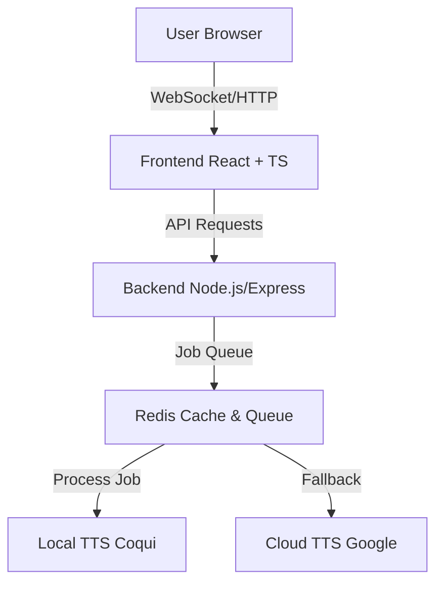

Here is the rewritten documentation in a clean, professional Markdown format.

# 🎵 Audiobook Studio - Complete Edition

> **Professional audiobook generation with local TTS and cloud fallback.**

A comprehensive solution for creators to produce high-quality audiobooks using self-hosted AI tools with robust cloud redundancy.

---

## 📋 Table of Contents

* [Features](https://www.google.com/search?q=%23-features)
* [Quick Start](https://www.google.com/search?q=%23-quick-start)
* [System Requirements](https://www.google.com/search?q=%23-system-requirements)
* [Installation](https://www.google.com/search?q=%23-installation)
* [Usage](https://www.google.com/search?q=%23-usage)
* [Architecture](https://www.google.com/search?q=%23-architecture)
* [Configuration](https://www.google.com/search?q=%23-configuration)
* [Troubleshooting](https://www.google.com/search?q=%23-troubleshooting)
* [Support](https://www.google.com/search?q=%23-support)

---

## ✨ Features

### Core Functionality

* **📝 Manuscript Editor:** Rich text editing with syntax highlighting for better script management.
* **🎤 Local TTS Engine:** Integrated **Coqui TTS** for high-quality, privacy-focused audio generation.
* **☁️ Cloud Fallback:** Automatic failover to Google Cloud TTS if the local engine encounters errors.
* **🔄 Smart Reconnection:** Implements exponential backoff with event queuing for network stability.
* **📊 Real-time Progress:** WebSocket integration for live updates during the generation process.
* **💾 Project Management:** Full save/load capabilities to manage multiple book projects.
* **🎵 Audio Processing:** Native **FFmpeg** integration for merging chapters and optimizing audio levels.
* **📦 Multiple Export Formats:** Support for `MP3`, `WAV`, `M4B`, and `FLAC`.

### Technical Features

* **🐳 Docker Deployment:** Single-command setup using `docker-compose`.
* **🚀 GPU Acceleration:** NVIDIA CUDA support for **5-7x faster** generation speeds.
* **🔐 Security:** Local-only authentication and SSL/TLS support.
* **📈 Scalability:** Redis job queue ensuring horizontal scaling readiness.
* **🏥 Health Checks:** Automatic service monitoring and self-healing recovery.
* **📊 Monitoring:** Integrated Prometheus metrics and logging.

---

## 🚀 Quick Start

### Prerequisites

* **Docker & Docker Compose** (Recommended)
* *OR* Node.js 18+, Python 3.9+, FFmpeg
* **RAM:** 8GB minimum (16GB recommended)
* **Disk:** 50GB free space

### Option 1: Docker (Recommended - 5 minutes)

```bash
# 1. Clone repository
git clone https://github.com/yourusername/audiobook-studio.git
cd audiobook-studio

# 2. Copy environment file
cp .env.example .env

# 3. Start all services
docker-compose up -d

# 4. Verify services are running
docker-compose ps

# 5. Access application
# Open browser to http://localhost:5173

```

### Option 2: Local Installation (15 minutes)

See `INSTALLATION.md` for detailed manual setup instructions.

---

## 💻 System Requirements

| Tier | Use Case | CPU | GPU | RAM | Storage |
| --- | --- | --- | --- | --- | --- |
| **Minimum** | CPU-only generation | i5 / Ryzen 5 (4 cores) | N/A | 8GB | 50GB SSD |
| **Recommended** | Standard production | i7 / Ryzen 7 (8 cores) | GTX 1650+ (4GB) | 16GB | 100GB SSD |
| **Premium** | High-performance | i9 / Ryzen 9 (12+ cores) | RTX 3080+ (8GB+) | 32GB+ | 500GB NVMe |

---

## 📦 Installation

### Docker Installation Steps

1. **Install Docker & Docker Compose**
* [Docker Desktop](https://www.docker.com/products/docker-desktop) (Windows/macOS)
* [Docker Engine](https://docs.docker.com/engine/install/) (Linux)


2. **Clone Repository**
```bash
git clone https://github.com/yourusername/audiobook-studio.git
cd audiobook-studio

```


3. **Configure Environment**
```bash
cp .env.example .env
# Edit .env if custom ports or API keys are needed

```


4. **Start Services**
```bash
docker-compose up -d

```


5. **Verify & Access**
```bash
curl http://localhost:3000/health

```


* **Frontend:** `http://localhost:5173`
* **Backend API:** `http://localhost:3000`
* **TTS Engine:** `http://localhost:5000`


---

## 🎯 Usage

### Basic Workflow

1. **Create Project:** Click "New Project", enter metadata (Title, Genre, Language).
2. **Upload Manuscript:** Paste text or import files.
* Use `# Chapter Name` to denote new chapters.
* Use `* * *` to denote speaker changes (for dual voice modes).


3. **Configure Voices:** Select Narrator, Speed (0.5x - 2.0x), Pitch, and Emotion.
4. **Generate Audio:** Click "Generate" and monitor real-time progress via the progress bar.
5. **Export:** Select format (`M4B` recommended for audiobooks) and download.

### Advanced Features

* **Voice Cloning:** Create custom voices by uploading 60s of reference audio.
* **Batch Processing:** Queue multiple chapters or books simultaneously.
* **Cloud Sync:** Backup project files to S3/Google Drive.
* **Collaboration:** Invite team members to edit manuscripts.

---

## 🏗️ Architecture

### System Overview



### Service Components

| Service | Technology | Port | Purpose |
| --- | --- | --- | --- |
| **Frontend** | React + Vite | `5173` | Web User Interface |
| **Backend** | Node.js + Express | `3000` | API Server & Orchestration |
| **TTS Engine** | Python + FastAPI | `5000` | Audio Generation Worker |
| **Redis** | Redis | `6379` | Job Queue & Caching |
| **Nginx** | Nginx | `80`/`443` | Reverse Proxy & Load Balancing |

---

## ⚙️ Configuration

### Environment Variables

Edit the `.env` file to customize your instance.

```bash
# Frontend
VITE_API_URL=http://localhost:3000
VITE_WS_URL=ws://localhost:3000

# Backend
NODE_ENV=production
PORT=3000
AUTH_TOKEN=your-secure-token

# TTS Service
TTS_SERVICE_URL=http://tts-engine:5000
TTS_FALLBACK_ENABLED=true
TTS_FALLBACK_PROVIDER=google

# Database
DATABASE_URL=sqlite:///./data/audiobook_studio.db

# Redis
REDIS_URL=redis://redis:6379

```

### GPU Configuration

To enable NVIDIA CUDA acceleration:

1. **Install Runtime:**
```bash
sudo apt-get install nvidia-docker2
sudo systemctl restart docker

```


2. **Update .env:**
```bash
TTS_DEVICE=cuda
TTS_GPU_MEMORY_FRACTION=0.8

```


3. **Restart Container:**
```bash
docker-compose restart tts-engine

```


---

## 🔧 Troubleshooting

### Common Issues

> **Q: Services won't start?**

```bash
# Check logs for errors
docker-compose logs -f

# Check for port conflicts
lsof -i :3000

# Rebuild containers
docker-compose down
docker-compose up -d --build

```

> **Q: Out of memory (OOM) errors?**

```bash
# Check current usage
docker stats

# Switch to a smaller model in .env
TTS_MODEL=tts_models/en/ljspeech/glow-tts

# Restart TTS service
docker-compose restart tts-engine

```

> **Q: GPU is not being used?**

```bash
# Verify NVIDIA drivers on host
nvidia-smi

# Check container visibility
docker-compose exec tts-engine python -c "import torch; print(torch.cuda.is_available())"

```

---

## 📚 Documentation & Resources

* 📄 [Installation Guide](https://www.google.com/search?q=INSTALLATION.md)
* 📖 [User Manual](https://www.google.com/search?q=USER_GUIDE.md)
* 🐳 [Docker Operations](https://www.google.com/search?q=DOCKER_GUIDE.md)
* 🔌 [API Reference](https://www.google.com/search?q=API_REFERENCE.md)
* 🛠 [Technical Architecture](ARCHITECTURE.md)

---

## 🤝 Contributing

We welcome contributions! Please follow these steps:

1. Fork the repository.
2. Create a feature branch: `git checkout -b feature/amazing-feature`
3. Commit changes: `git commit -m 'Add amazing feature'`
4. Push to branch: `git push origin feature/amazing-feature`
5. Open a Pull Request.

---

## 📄 License

This project is licensed under the **MIT License** - see the `LICENSE` file for details.

---

## 💬 Support

* **Documentation:** See `docs/` directory
* **Issues:** GitHub Issues
* **Email:** support@audiobook-studio.com

---

*Made with ❤️ for audiobook creators*
*Last Updated: December 31, 2025*

---

