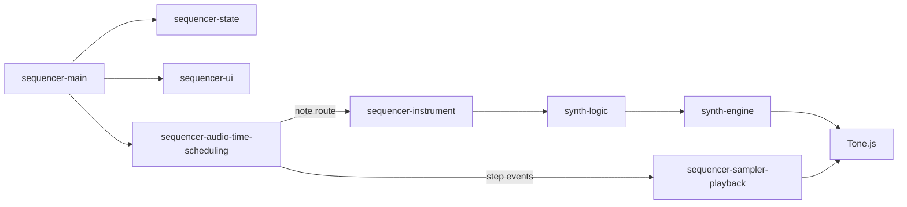

# Architecture & Data Flow

**Key Paths**
- **Boot:** main → config/state → UI → transport/schedule
- **Playback:** schedule tick → sampler/instrument dispatch
- **Save/Load:** UI → {sequencer-save-load|synth-save-load} → JSON

**Audio Graphs (textual)**
- **Sampler:** Player → Envelope → Channel Gain → Master → Limiter
- **Synth:** Osc/Noise → Filter/FX chain → VCA → Master → Limiter
