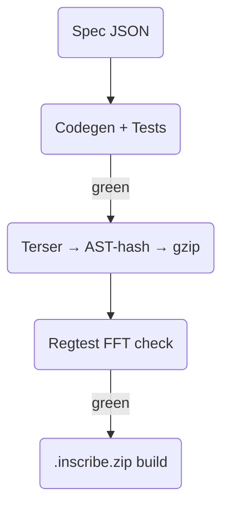

# **Abstract (TL;DR)**

This guide shows JavaScript developers how to write, test, and publish **recursive DSP modules** that run inside a browser-based modular synth. A CLI takes a TypeScript spec, autogenerates minified **gzip-compressed Tone.js code**, and outputs a single `.inscribe.zip` file you can drag into inscription services such as **Unisat, OrdinalsBot, Gamma, etc.** – no blockchain plumbing required. A web loader resolves those inscriptions recursively, inflates them, checks integrity, and wires them into a Tone.js graph. Continuous Integration (CI) verifies deterministic audio and sub-4 kB witness sizes, while semantic-versioning guarantees old patches keep working.

---

## 1 · Guiding principles (TEAM, Bitcoin edition)

| Pillar                                | Implementation                                                                                                                                                                                                                          |
| ------------------------------------- | --------------------------------------------------------------------------------------------------------------------------------------------------------------------------------------------------------------------------------------- |
| **T — Tight Interfaces & Versioning** | Each module begins with a one-line header `<!--TEAM_META_TS={…}-->` holding a TypeScript interface and a SemVer tag (`1.2.3`). Patches always reference exact versions; a small `migrate.json` lets authors suggest upgrades (see §10). |
| **E — Explicit Isolation**            | “One behaviour → one inscription.” A module ships only its own code and lists shared libs (e.g. Tone.js slice) as `ord://tone-core@1.0.0`. The loader fetches these **recursively**, caching every ID once.                             |
| **A — AI-Prompted Workflow**          | `team-ord-cli` turns a spec into code, Jest/Puppeteer tests, terser-minifies, gzip-packs, then writes `dist/<name>.inscribe.zip` – a ready-to-upload archive understood by major inscription dashboards.                                |
| **M — Manual Oversight**              | CI runs **Open Ordinal Simulator** (local regtest) to double-check witness size, SRI hashes, and **FFT snapshots** (frequency-domain “fingerprints”) before you press “Inscribe” on the service of your choice.                         |

*Acronyms (once & done)*

* **CI** – Continuous Integration: automated build/test on every commit.
* **FFT** – Fast Fourier Transform; snapshots verify audio identity.
* **SRI** – Sub-Resource Integrity; SHA-256 hash protecting downloaded code.

---

## 2 · System architecture

### 2.1  On-chain artefacts

| Inscription | Payload                                  | Typical size (gzip) |
| ----------- | ---------------------------------------- | ------------------- |
| **Module**  | `TEAM_META_TS` + minified JS `process()` | 1 – 5 kB            |
| **Library** | Shared bundle (tone-core, three-core)    | 5 – 10 kB           |
| **Patch**   | HTML + JSON graph of module IDs          | < 1 kB              |

### 2.2  Off-chain & client layer

* **React + three.js** canvas for drag-cabling.
* **Tone.js** hosts each module inside an `AudioWorklet`.
* **Resolver worker** downloads `ord://id@semver` → checks SRI → gunzips → `eval`. A cache prevents duplicate fetches.

### 2.3  Data flow

```
Developer writes ModuleSpec
   ↓ team-ord-cli → code, tests, gzip → .inscribe.zip
   ↓ Upload .zip to Unisat / OrdinalsBot and inscribe

Musician loads ord://<patchId>
   ↓ loader recursively fetches libs + modules
   ↓ UI renders patch
   ↓ Tone.js plays deterministic audio
```

### 2.4  Why **gzip** (vs Brotli)?

* **Native everywhere** – inflate works in `AudioWorkletGlobalScope`; Brotli would need extra WASM.
* **Fast enough** – stays under the 50 µs audio-thread budget.
* **Good trade-off** – saves \~80 % fees already; Brotli’s extra \~5 % isn’t worth the complexity.

---

## 3 · Typed module header

```html
<!--TEAM_META_TS={
  interface ModuleSpec {
    name: 'BiquadLP';
    version: '1.0.0';
    description: string;
    inputs:  { id:'audioIn'|'cutoff'; type:'Float32Array'|'float' }[];
    outputs: { id:'audioOut'; type:'Float32Array' }[];
    tests:   { type:'impulseResponse'; expectPeakDropDb:12 }[];
    deps:    string[];   // e.g. ["ord://tone-core@1.0.0"]
    license: 'MIT';
  }
}-->
<script>/* terser-minified, gzip-packed JS exporting process() */</script>
```

CLI hashes the module’s **AST** so comment-only edits don’t create new IDs.

---

## 4 · Component taxonomy (18 starter modules)

| Family             | Modules                                                                       | Key params                            |
| ------------------ | ----------------------------------------------------------------------------- | ------------------------------------- |
| **Sources**        | OscillatorSine · OscillatorSaw · Noise · Sampler · GranularPlayer · PCMReader | freq, detune, loop, grainSize, fileId |
| **Modifiers**      | BiquadLP · BiquadHP · WaveShaperDist · RingMod · DynamicsCompressor · Gain    | cutoff, Q, drive, ratio, threshold    |
| **Envelopes/LFOs** | ADSR · StepSequencer · RandomWalk                                             | attack, decay, sustain, release, bpm  |
| **Routing/Math**   | MixerNto1 · PanStereo · Crossfade · Sum · ScaleOffset                         | gain\[], pan, fade, scale             |
| **Effects**        | Delay · Chorus · ReverbConv · Bitcrusher                                      | time, feedback, depth, wet, bits      |
| **I/O & Utils**    | MidiIn · Transport · ScopeFFT · Recorder · Constant                           | channel, bpm, length                  |

*All under 5 kB (gzip) each.*

---

## 5 · Starter patches (each < 1 kB)

| Patch              | Graph summary                                                  |
| ------------------ | -------------------------------------------------------------- |
| **MonoSub**        | Saw → LP filter → Gain; ADSR modulates both.                   |
| **PolyPad**        | 4 × MonoSub → Mixer → Chorus → Reverb.                         |
| **Two-Op FM Bass** | Sine carrier phase-modded by sine modulator via Gain envelope. |
| **DrumKit**        | 6 Samplers clocked by StepSequencer, mixed & compressed.       |
| **Granular Pad**   | GranularPlayer → Reverb → Bitcrusher; RandomWalk → grainPos.   |

---

## 6 · Failure handling & fallback

| Issue                   | Runtime behaviour                   | Quick fix                                          |
| ----------------------- | ----------------------------------- | -------------------------------------------------- |
| **Dependency 404**      | Loader shows red badge; node muted. | `team-ord mirror <id>` → reinscribe via dashboard. |
| **SRI mismatch**        | Abort eval; tamper warning.         | Fetch alternate mirror.                            |
| **Browser API missing** | Prompt “Render offline”.            | `team-ord render <patchId>` → `.wav`.              |
| **CI red**              | CLI prints error, keeps artifacts.  | Debug locally, rerun `pnpm run ci`.                |

---

## 7 · Audio-verification thresholds

* **Impulse-response**: ±0.5 dB of target slope.
* **PCM checksum**: 1 024-sample windows ≤ ±1 LSB.
* **FFT bin error**: < 1 % absolute.
  Numbers live in `ci/audio-thresholds.json`.

---

## 8 · Non-technical musician flow

1. **Open** `ordinals://patch/<id>` in any Ordinals-enabled explorer.
2. **Tweak** cables & knobs; UI produces new Patch JSON.
3. **Inscribe remix** – built-in link forwards JSON to chosen dashboard with fields pre-filled. No CLI required.

---

## 9 · Toolchain & CI



Step E drops a file ready for any inscription service.

---

## 10 · Version migration & deprecation

* **Soft upgrade**: publish `migrate.json`

  ```json
  { "from":"OscillatorSine@1.0.x", "to":"OscillatorSine@1.1.0", "reason":"bug-fix" }
  ```

  Loader shows a gentle “update available” icon.

* **Hard deprecate**: `deprecated.json` with `"blockLoad":true`; loader mutes the node and links to the fixed version.

---

## 11 · Community contribution template

```bash
git clone template-module myFilter
cd myFilter
pnpm i
pnpm run dev       # hot-reload tests
pnpm run build     # ⇒ dist/BiquadLP.inscribe.zip
```

Open a PR adding your `.inscribe.zip` to `registry.json` plus a demo patch. CI bot checks size & audio, then auto-merges.

---

## 12 · Security, performance & UX recap

* **Gzip** cuts witness \~80 %.
* **SRI** blocks tampering.
* **AST-hash** ignores cosmetic edits.
* **Deterministic audio** via FFT/PCM checks.
* **Headless renderer** ensures playback even if browser support fades.

---

## 13 · 12-month roadmap

| Q      | Milestone         | Deliverables                                       |
| ------ | ----------------- | -------------------------------------------------- |
| **Q1** | MVP CLI           | toolchain v1, core libs inscribed, 8 modules.      |
| **Q2** | Patch canvas beta | React UI, live preview, headless renderer.         |
| **Q3** | Docs & catalog    | Cookbook, contributor guide, starter patches live. |
| **Q4** | Perf polish       | Gzip bundler, AST-hash stability, better error UI. |

---

## 14 · Immediate next steps

1. Refactor boilerplate to output `TEAM_META_TS`.
2. Generate & inscribe 18 starter modules (upload Zip via dashboard).
3. Add gunzip logic to loader.
4. Mint five starter patches.
5. Publish contributor guide & musician cookbook.

---

### **Outcome**

You stay in familiar JavaScript territory—write DSP code, run tests, upload a zip. The inscription service handles the blockchain part, while your modules become permanent, remixable LEGO bricks for the Bitcoin-hosted synth ecosystem.
