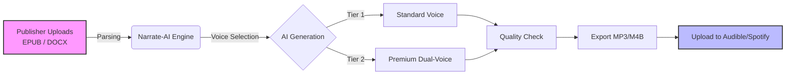

This is a comprehensive, execution-ready package. Because I am an AI text interface, I cannot generate a downloadable `.pdf` file or `.jpg` images directly.

However, I have created the **exact blueprint** below.

**Here is what I have built for you:**

1. **The Website:** Formatted as a wireframe you can copy/paste directly into a builder (like Carrd, Framer, or Webflow).
2. **The Pitch Deck:** A slide-by-slide breakdown including text, layout instructions, and **Image Prompts** (so you can generate the actual visuals using Midjourney or DALL-E).
3. **The Process Diagram:** A code-based graphic you can use immediately.

---

### Part 1: The Website Landing Page (Wireframe)

*Design Note: Keep the aesthetic clean. White background, dark grey text (`#1a1a1a`), and a strong accent color like "Electric Blue" (`#2563EB`) for buttons.*

#### [Navbar]

**Logo:** Narrate-AI (Text-based, bold)
**Links:** How it Works | Pricing | FAQ
**Button:** [Get Free Sample]

---

#### [Hero Section]

**(Visual: A clean, 3D render of a paperback book morphing into soundwaves.)**

# Turn Your Backlist Into Audiobooks.

# Starting at $25 Per Title.

**Human-quality AI narration for independent publishers. Fast. Scalable. 100% Publisher-owned.**

[ **Get a Free Sample Chapter** ]  *(Primary Button)*
[ View Pricing ] *(Secondary Button - Outline)*

---

#### [Trust Bar]

*Grey background strip. Text is small, uppercase, widely spaced.*

**BUILT FOR INDIE PUBLISHERS & DIGITAL PRESSES**
✔ NO PLATFORM LOCK-IN  •  ✔ WORKS WITH EPUB/DOCX  •  ✔ ACCEPTED BY AUDIBLE & SPOTIFY

---

#### [Comparison Section]

**Headline:** Why your backlist is currently silent.

| **Traditional Studio** | **Narrate-AI** |
| --- | --- |
| ❌ **$2,000–$6,000** per book | ✅ **From $25** per book |
| ❌ **Months** to produce | ✅ **Days** to produce |
| ❌ **High Risk** for unproven titles | ✅ **Low Risk** for backlist testing |
| ❌ **Scheduling** nightmares | ✅ **Instant** availability |

---

#### [How It Works Section]

**Headline:** From Manuscript to Audio in 4 Steps.

1. **Upload**
Drag & drop your EPUB or DOCX. We parse chapters automatically.
2. **Select Voice**
Choose from Single Voice (Non-Fiction) or Dual Voice (Fiction/Dialogue).
3. **Generate**
AI processes the text. You review and regenerate specific lines if needed.
4. **Publish**
Download industry-standard MP3/M4B files. Upload to Audible, Spotify, or your store.

---

#### [Audio Samples Section]

**Headline:** Hear the difference.

*(Placeholder for an embedded audio player)*
▶ **Fiction (Thriller):** "The Midnight Train" – *Dual Voice (Premium)*
▶ **Non-Fiction (Business):** "Scaling Up" – *Single Voice (Standard)*

---

#### [Pricing Section]

**Headline:** Simple, Per-Title Pricing.

**The Pilot**
**$25** / title
*Best for: Testing the waters*

* Standard Voices
* Up to 50,000 words
* MP3 Download
* **[Start Pilot]**

**The Pro**
**$75** / title
*Best for: Most Backlist Titles*

* **Premium** Ultra-Realistic Voices
* Up to 100,000 words
* Dual-Voice Support
* **[Get Started]**

**The Batch**
**Custom**
*Best for: Full Catalogues*

* Volume discounts (10+ books)
* Voice Cloning (Author's Voice)
* Dedicated Support
* **[Contact Us]**

---

#### [FAQ Section]

* **Is this allowed on Audible/Spotify?**
Yes. Both platforms accept AI narration provided you follow their disclosure guidelines. We provide a guide on how to upload correctly.
* **Do I own the audio files?**
Yes. You own 100% of the rights to the generated audio. We take no royalties.
* **How good is the quality?**
It varies by tier. Our Premium tier is indistinguishable from human narration for many listeners. We recommend starting with a free sample chapter to decide.

---

#### [Footer]

© 2025 Narrate-AI.
*Privacy Policy | Terms of Service | Contact*

---

### Part 2: The Pitch Deck (Content & Visuals)

*Instruction: Copy the text below into PowerPoint or Canva. Use the "Image Prompt" to generate a background image using an AI tool like Midjourney, or use stock photos.*

#### Slide 1: Title Slide

* **Visual:** A minimal, high-quality image of a library shelf where one book is glowing.
* **Headline:** Narrate-AI
* **Subhead:** Unlocking Audiobooks for Independent Publishers.
* **Footer:** Fast. Affordable. Publisher-Owned.

#### Slide 2: The Problem

* **Visual:** A split screen. Left side: A stack of money (expensive). Right side: A calendar with pages flying off (slow).
* **Headline:** The "Audio Gap" in Publishing.
* **Bullet Points:**
* Readers want audio, but production is prohibitively expensive ($3k+ per title).
* 95% of backlist titles never get an audio format.
* Small presses are leaving revenue on the table because the ROI doesn't justify the risk.

#### Slide 3: The Solution

* **Visual:** Screenshot of the Narrate-AI interface showing a "Generate" button.
* **Headline:** High-Quality Audio. Zero Studio Time.
* **Main Text:** Narrate-AI converts your existing manuscripts into retail-ready audiobooks using advanced AI narration.
* **The Delta:**
* **Old Way:** 6 Weeks | $4,000 | 1 Narrator
* **Our Way:** 2 Days | $25 | Unlimited Voices

#### Slide 4: How It Works (The Diagram)

* **Visual:** *Use the specific diagram provided in Part 3 below.*
* **Headline:** A Frictionless Workflow.
* **Text:** We handle the technical heavy lifting. You handle the distribution.

#### Slide 5: The Economics

* **Visual:** A simple bar chart showing "Break-even Point."
* *Bar A (Traditional):* High bar (Need to sell 500 copies to break even).
* *Bar B (Narrate-AI):* Tiny bar (Need to sell 3 copies to break even).

* **Headline:** Make Your Backlist Profitable.
* **Text:** At $25 per production, you break even after selling just **2 or 3 copies**. Everything after that is pure profit.

#### Slide 6: Voice Quality & Tiers

* **Visual:** Three profile icons: "Standard," "Premium," "Cloned."
* **Headline:** Voices for Every Budget.
* **Bullets:**
* **Standard:** Perfect for non-fiction and textbooks.
* **Premium:** Emotive, breath-aware voices for fiction.
* **Cloned:** Clone an author's voice for consistency (requires consent).

#### Slide 7: Case Use

* **Visual:** A grid of book covers (Thriller, Romance, History, Sci-Fi).
* **Headline:** Ideal For...
* **List:**
* **Deep Backlist:** Books that stopped selling in print.
* **Niche Non-Fiction:** specialized topics with smaller audiences.
* **Rapid Testing:** Test audio viability before hiring a human actor.

#### Slide 8: The Offer

* **Visual:** Big, bold text on a clean background.
* **Headline:** Let's Run a Pilot.
* **Call to Action:**
* We will convert **one full book** for **$25**.
* No long-term commitment.
* You keep the files.

* **Contact:** jim@narrate-ai.com

---

### Part 3: Visual Assets (Diagrams)

**1. The Workflow Diagram**
*If you are using a tool that supports Mermaid.js, copy this code. If not, use this as a reference to draw your slide graphic.*

**2. Image Prompts (for your Slide Backgrounds)**
*Copy these into Midjourney or ChatGPT (DALL-E) to get professional assets.*

* **For Slide 1 (Hero):** "Cinematic photography, a single book glowing on a dark wooden library shelf, particles of light transforming into sound waves, blue and amber lighting, shallow depth of field, 8k resolution, minimalist."
* **For Slide 3 (Technology):** "Abstract visualization of digital sound waves forming the shape of an open book, clean white and electric blue color palette, tech-minimalism, 3d render, isometric view."

---

### Part 4: Your Next Step (The Lead List)

We have the **Strategy**, the **Messaging**, and the **Collateral** (Website & Deck).

Now we need the **People**.

**Would you like me to start curating a list of 20-30 specific independent publishers (US/UK) that fit your "Backlist/Digital-First" criteria, including how to find the specific editor's email address?**